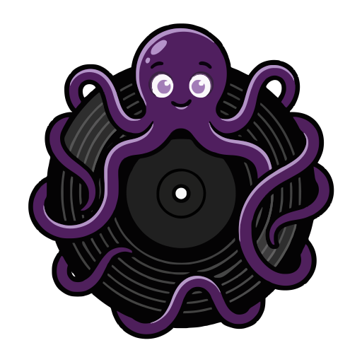

<div align="center">
  
  <h1>Tidalarius</h1>
  <p>A self-hosted, sleek Tidal playlist sync and download manager with web player.</p>
</div>

## Overview

Tidalarius is a local web application that connects to your Tidal account, allowing you to seamlessly synchronize, download, and manage your Tidal playlists. It features a modern, responsive web interface, real-time WebSocket syncing, high-resolution audio downloading, and a built-in web player to stream your downloaded files.

## Features

- **Tidal Integration**: Connect directly to your Tidal account using device login.
- **Playlist Syncing**: Select specific qualities (up to HI_RES_LOSSLESS) and automatically download playlists as `.flac` or `.m4a`.
- **Single Track Management**: Download or delete individual tracks directly from the UI.
- **Web Player**: Listen to your downloaded tracks directly in the browser with a sleek, gapless-ready player.
- **Real-Time UI**: Sync progress and events are broadcasted to all open clients via WebSockets.
- **Dockerized**: Easy to deploy with zero messy dependencies using Docker and docker-compose.
- **Mobile Friendly**: The UI is fully responsive and looks great on desktop, tablet, and mobile.

## Installation

Tidalarius is built to be run via Docker. It uses a clean multi-stage build, ensuring no unnecessary build tools or `node_modules` remain in the final image.

1. **Clone the repository**:
   ```bash
   git clone https://github.com/Brakatuta/Tidalarius.git
   cd Tidalarius
   ```

2. **Start the container**:
   ```bash
   docker-compose up --build -d
   ```

3. **Access the application**:
   Open your browser and navigate to `http://localhost:8000`.

## Directory Structure (Volumes)

The `docker-compose.yml` mounts three distinct directories in the `./data` folder to keep your host clean:
- `/data/config`: Stores configuration files and Tidal session tokens.
- `/data/db`: Stores the local SQLite database (`tidalarius.db`).
- `/data/music`: The exclusive directory where all downloaded music files are stored.

## Usage

1. Open the web interface.
2. Click **Start Login Process** and follow the link to authorize the application with your Tidal account.
3. Once authenticated, your Tidal playlists will appear on the dashboard.
4. Click the gear icon on any playlist to enable syncing and choose your preferred audio qualities.
5. Click **Sync Now** to start the download process.

## Tech Stack

- **Frontend**: Vue 3 (Composition API), Vite, Tailwind CSS
- **Backend**: Python 3.13, FastAPI, SQLAlchemy (SQLite), tidalapi, websockets
- **Deployment**: Docker, Docker Compose

